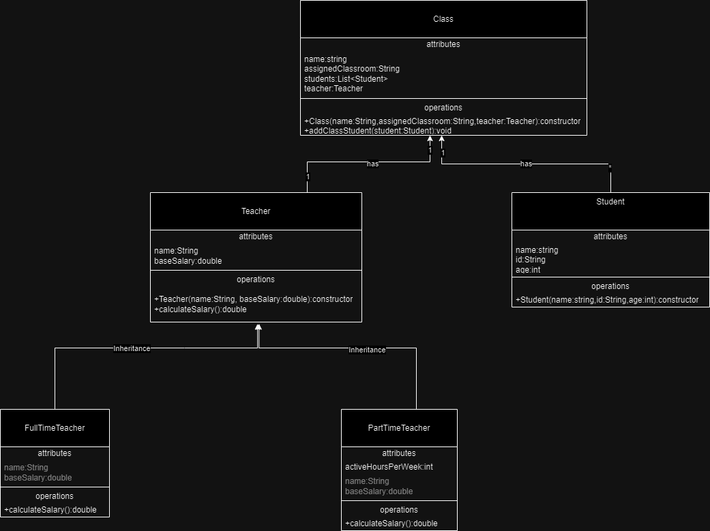

# TAE Java Final
## By: Tomás Duque 
# University Class Tracking System

This project is a management system designed to facilitate the tracking of classes, teachers, and students within a university setting. It allows for the creation and management of classes, including the assignment of teachers and students to each class.

## Features

- **Teacher Management**: Enables the registration of full-time and part-time teachers, including their personal details and specifics such as years of experience or active hours per week.
- **Student Management**: Facilitates the registration of students, allowing them to be added to specific classes.
- **Class Creation and Management**: Allows for the creation of classes, assigning a classroom, a teacher, and students to each.
- **Information Query**: Provides options to view data about teachers, students, and classes.

## Quick Start

1. **Clone the repository**:

   ```bash
   git clone https://github.com/TomasDuqueGlobant/TAEJavaFinal.git
   ```
2. **Navigate to the prohect directory:**

    ```bash
   cd TAEJavaFinal/src
   ```
3. **Run the application**

## Usage
Once the application starts, a menu of options will be displayed in the console. Select an option by entering the corresponding number and follow the on-screen instructions for each operation.
# Diagram


